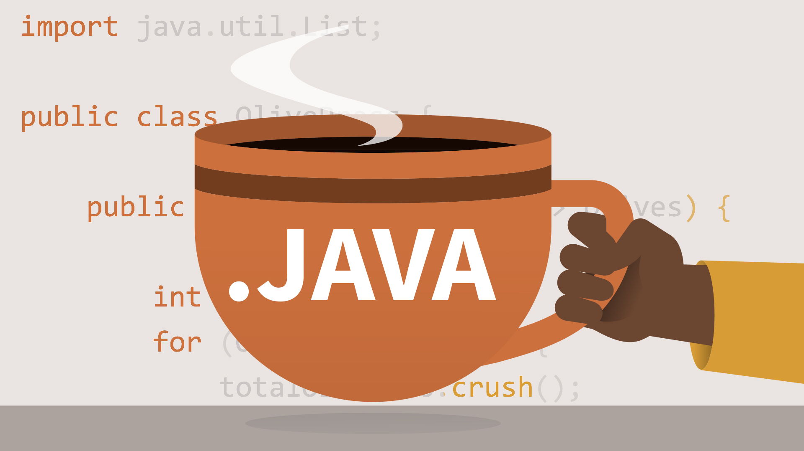

Giới thiệu về Java

Java là một ngôn ngữ lập trình hướng đối tượng được phát triển bởi Sun Microsystems (nay thuộc Oracle) vào năm 1995. Với triết lý "Viết một lần, chạy mọi nơi" (Write Once, Run Anywhere), Java được thiết kế để hoạt động trên nhiều nền tảng khác nhau.

Đặc điểm chính

Độc lập nền tảng: Mã Java được biên dịch thành bytecode, chạy trên JVM (Java Virtual Machine).

Bảo mật cao: Java có cơ chế sandbox và quản lý bộ nhớ tự động.

Hiệu suất tốt: Nhờ JIT (Just-In-Time) compiler.

Ứng dụng thực tế

Java được sử dụng trong:

Phát triển ứng dụng Android.

Xây dựng hệ thống backend cho website.

Ứng dụng doanh nghiệp lớn như hệ thống ngân hàng.