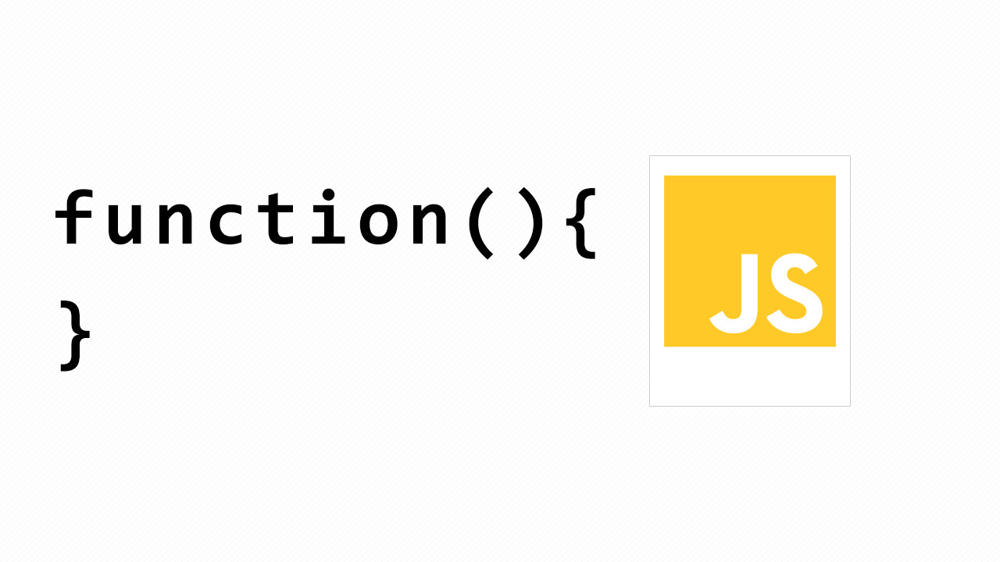

 Hàm trong JavaScript
Hàm là thành phần cốt lõi trong JavaScript, cho phép tái sử dụng mã và xử lý logic.

Cách khai báo hàm

Hàm thông thường:

```js
function chao(ten) {
  return `Xin chào, ${ten}!`;
}
```

Arrow function (ES6):

```js
const chao = (ten) => `Xin chào, ${ten}!`;
```

Đặc điểm

Hàm trong JavaScript là "first-class citizen", có thể được gán cho biến, truyền làm tham số, hoặc trả về từ hàm khác.
Hỗ trợ closure và callback.

Ứng dụng

Xử lý sự kiện (event handling).
Gọi API bất đồng bộ.
